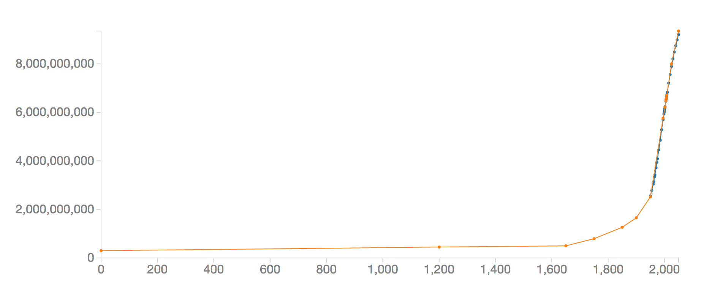
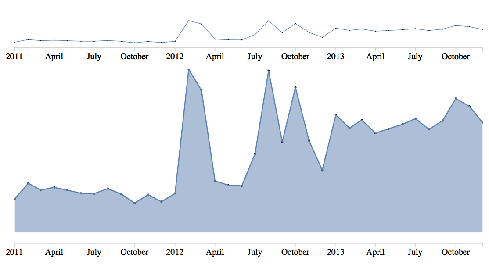
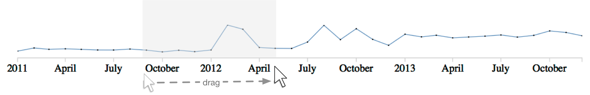

Temporal information is an important dimension in many datasets. Twitter feeds, stock prices, internet data flow, etc., all contain timestamps. Time can be used as an anchor to correlate different data sets. For example, Hurricane Sandy led to a significant drop in taxi rides in New York City while at the same time the number of news reports mentioning the terms "hurricane" and "sandy" peaked. Another example are stock prices of a company, which might enable us to spot important events in the company's history (take [Apple's stock](https://www.google.com/finance?q=NASDAQ:AAPL&sa=X&ei=wpYHU7j5IfbLsQSU54K4CQ&ved=0CCwQ2AEwAA) as an [example](http://www.investopedia.com/articles/stocks/12/history-apple-stock-increases.asp)). Other examples from the large set of applications for timeline visualizations are project planning ([Gantt charts](http://en.wikipedia.org/wiki/Gantt_chart)), sound and video editing, digital forensics, surveillance analysis, and music analysis.

In this homework, we will explore the design space for visualizing time series data. We will spend time thinking about the various visualizations we could use and implement some ideas. The following steps are a guideline that you can use for most visualization projects:

1. Define your goal - what do you want to show with your visualization?
2. Acquire and familiarize yourself with the data. Validate whether the data is suitable for your goal. 
3. Pre-process and clean the data. 
4. Iterate over the visual design. Decide on the mapping of data to visual variables, and iterate over the interaction design.
5. Implement your idea. 
6. Validate the idea. 

At the end of the homework you will know how to scrape data from web pages, visualize trends in D3, and have explored various designs for showing differences in temporal data. You will also have a project proposal that will be your guide for the next several weeks. To enjoy it most, you should start early and give yourself some time to think.


## Problem 0

We would like to hear your feedback on Homework 2. Please fill out the [feedback form](https://docs.google.com/forms/d/1x2HAafVqs38YRcOWyjBsRR4gy8VGjMp_ud0GIo-_sGM/viewform). 

## Problem 1 - Final Project Proposal

You must hand in your project proposal together with this homework. You can find details about the project proposal on the [CS 171 website](http://www.cs171.org/#!project.md). Your proposal consists of two parts:

1. The project data form that [you can fill out here](https://docs.google.com/forms/d/1L7bb7R9J3yA8NSnz7tpOlOX8TFNAv9AMZCQsBQqTkMk).
2. The proposal document. 

You may only fill out the project data form **once per team**. You must submit your (identical) proposal document **once per person**. Put the project proposal in a file *proposal_lastname1_lastname2_lastname3.pdf* in your git repository.

## What's in the repository?

This repository contains the following directories:

- **/libs** contains helper libraries -- [jQuery](http://jquery.com/) by jQuery Foundation,  [cross-domain-ajax](http://james.padolsey.com/javascript/cross-domain-requests-with-jquery/) from James Padolsey, and FileSaver.js by [Eli Grey](http://eligrey.com)
- **/ProblemX** templates/stubs for the related Problem *X*
- If you use a local web server (e.g., Python) to test your implementations, be sure that it provides access to the **/libs** directory


## Problem 2: Comparing Timelines

*The files related to this problem are in the folder Problem2.*

"Who Am I? And If So, How Many?" is the title of a book by philosopher Richard David Precht. The title mixes essential questions about human existence into an amusing confusion. It leads us to the data and the related questions for Problem 2. We want to visualize the size of the world's population. How many of us are there?  How many have there been in the past? How many will we be? How consistent or different are the numbers across population estimates?

Estimating the size of the world's population is addressed by different researchers and agencies. Wikipedia offers one summary of this data for estimated historic, recent, and projected future population [here](http://en.wikipedia.org/wiki/World_population_estimates). Put yourself in the role of a Wikipedia contributor and think of how you would visualize the tabular data. The goals for our visualization are:

- **G1**: Visualize the population from the year 0 to 2050 considering the competing estimates.
- **G2**: Visualize the difference between the competing estimates.

The following sections describe different parts of handling the data and creating a visualization of this dataset.


### Acquiring the Data 
*In this section we will perform web scraping with JavaScript, as introduced in Lab 5. If you prefer, you can also scrape the data in another language, like Python. If you decide to do so, make sure to include all necessary code and libraries in your submission. You still have to answer questions 1 and 2.*

In the last homework you used data that was available through an API. Not all data is provided through a machine readable interface, which makes it necessary to occasionally scrape data directly from HTML pages meant for human reading. In this exercise, we use a modified [jQuery Ajax call](https://api.jquery.com/jQuery.ajax/) to grab data from a Wikipedia page. 

When scraping data, you should be aware of the site's terms of service and the [robots.txt](http://en.wikipedia.org/wiki/Robots.txt) included with many web pages, and adhere to the rules outlined therein.

Let's get started! We want to create a script that converts the information contained in an HTML table into a comma-separated list which we can later easily copy and paste into a `.csv` file. While we could include this step directly in our visualization code, we do this only once in order to avoid exceeding request limits when testing our visualization and to reduce load time. This is reasonable, since we do not expect the data to change frequently.

File `Problem2/dataExportWiki.html` includes the necessary libraries and a template to get you started. The script first calls the Wikipedia page and returns the HTML to an inline callback function on *success* or returns an *error*:

	$.ajax({
	  url: "http://en.wikipedia.org/wiki/World_population_estimates",
	  type: 'GET',
	  cache: false,
	  success: function(data) {
	  	... 
	  },
	  error: function() {
   		...
	  });

After converting the HTML string into [jQuery DOM elements](http://api.jquery.com/jQuery/#jQuery2), we make use of the [`.find(x)`](http://api.jquery.com/find/) method, which acts like the `.selectAll(x)` that we know from D3. The method takes a CSS selector to find/select the respective nodes in a DOM subtree. Now is the perfect time to take a look at [selectors in jQuery](http://www.w3schools.com/jquery/trysel.asp), as they might be handy for solving the tasks at hand. 


	var content = root.find("#content"); // find the node that has ID "content"
	var spans = content.find(".mw-headline"); // search in the "#content" node for nodes of class "mw-headline"

The variable `spans` should now contain an array of ".mw-headline" elements. You can iterate over this array and output the text enclosed by the `<span class = ".mw-headline">text</span>` tags:

	$.each(spans, function(index, value) {
	     console.log($(value).text()); // print plain text of all children!!!	});


#### Questions 
*Answer in the file `Problem2/answers2.md`. Answer these questions even if you use Python for scraping.*

1. Look at the data given in the Wiki table. Describe the data types. What is different from the datasets you've used before? 

2. Take a look at the DOM tree for the Wikipedia table. Formulate in [jQuery selector syntax](http://www.w3schools.com/jquery/trysel.asp) the selection that would give you the DOM element for the second row in the Wikipedia table. Write down in selection syntax how you would get all table rows that are not the header row. 

#### Implementation Tasks 
*Put your code in the file `dataExportWiki.html`, or `dataExportWiki.py`.*

Implement a script that scrapes the data of the Wikipedia page and saves them in a .csv file. Use only data from the first five columns (United States Census Bureau, Population Reference Bureau, United Nations Department of Economic and Social Affairs, HYDE and Maddison). These columns contain the most recent estimates. Collect only the data for the range 0 to 2050. Ignore empty rows. Make sure to include the header row as given in the example. 

Here is some guidance on how to do that:

- Write `find()` functions using selectors for the table and the rows. Iterate through the rows.

- Convert the strings into numbers (integers) by using the `convertToInt(x)` function. This function converts the numbers that contain thousand separators to machine readable numbers (e.g., 300,000,000 becomes 300000000). Make sure to preserve empty cells.

- Save each row as a comma-separated string. Add the string to an array. Use the `saveToFile(arrayOfLines, fileName)` function to save your result to a file. 

The output should look like the following :

```
year,USCensus,PopulationBureau,UN,HYDE,Maddison 
0,,300000000,300000000,,230820000
1000,,,310000000,,267573000
1200,,450000000,,,
....
```


### Data Handling & Visualization

When looking at the data, you will notice that not every column has data for each year (row). You need to consider this when choosing the data structure for your visualization. Take a look at the data munging functions for arrays in [JavaScript and D3](https://github.com/mbostock/d3/wiki/Arrays).

Use the data you just acquired in your own file. The file `Problem2/linegraph.js` contains the D3 & HTML boilerplate and includes a stub for reading the `.csv` data, in addition to some guidance on what to do next. The *bbVis* object in the template defines the specific x, y, width, and height parameters of our (sub-)visualization (i.e., its bounding box). This is considered good practice as it allows for later rearrangement of your visualizations within the SVG canvas. Whenever you translate and scale elements, you should use these parameters. The code includes one example of how to use this:

	bbVis = {
	      x: 0 + 100,
	      y: 10,
	      w: width - 100,
	      h: 100
	  };
	  
	// example that translates to the bottom left of our vis space:
	svg.append("g").attr({
		"transform": "translate(" + bbVis.x + "," + (bbVis.y + bbVis.h) + ")",
		....
	})

For more information, refer to Mike Bostock's D3 [Margin Convention](http://bl.ocks.org/mbostock/3019563).

#### Implementation Tasks 
*Write this code in the files linegraph.html and linegraph.js in the Problem2 folder.* 

1. Implement a function to read the data from your `.csv` file and represent the data in a usable format.
2. Implement a line graph which represents all five population estimates. Each data point should additionally be highlighted by a dot. Start and end the lines for each respective dataset with the first and last entry for each alternative estimate. For example, for the US Census Bureau, the line would start in 1950.  The following steps can be helpful:
  - Look at the documentation for [D3 line charts](http://bl.ocks.org/mbostock/3883245) and this [example](http://bl.ocks.org/mbostock/3884955).
  - Define the appropriate scales (use `bbVis` as limits for the visualization space).
  - Draw the x and y axes.



The screenshot shows the visualization for two different estimates !!

Now it's time for two minutes of procrastination and inspiration -- see this [time series video](http://www.youtube.com/watch?v=4S8GOQeSlTs).

### Interpolate Data Points
*Write this code in the files linegraph.html and linegraph.js in the Problem2 folder.*

To address Goal 2 - show the difference between estimates - we want to compare the estimates at every time step in the data. To do that, we need to fill in the missing cells so that our sparse data matrix is completely filled. However, we also want to distinguish between the original values and our newly created "artificial" values, so we need a way to "mark" the artificial values. 

#### Tasks

1. Use [linear interpolation](http://en.wikipedia.org/wiki/Linear_interpolation) to fill in the missing values within the columns. For example, in the Population Reference Bureau column, use linear interpolation from the 1995 and 2002 values for the intermediate years. 
Leave the values blank before the first entry of a column and after the last entry. For example, the US Census Bureau value for year 0 is undefined and should not be considered for comparison.
2. Render your line graph with these datasets. Visually distinguish your estimated data points from the original data points. 


### Visualize Differences Between Diverging Estimates (Design Studio 2)
*Include your analysis and designs in differenceGraph.pdf or differenceGraph.png. Include your implementation in differenceGraph.html/js. Include your arguments in differenceGraph.md. You might also re-use some code from linegraph.html/js*

You will work on the design for this part of the problem in Design Studio 2. Develop multiple (at least two) designs for a visualization that meets the following criteria:

* Instead of or in addition to showing 5 conflicting lines, develop a visualization that shows the data and the ambiguity. You can use a single visualization, or you can use multiple views. 
* Your visualization should show the divergence between estimates in absolute terms (i.e., the difference in number of people) as well as in relative terms (i.e., % of divergence/uncertainty relative to a consensus value).
* Your visualization should make it easy to read a specific "consensus number" for every year.

Choose your "best" visualization and implement it. Explain why you chose the design you implemented. 

## Problem 3: Exploring UN Twitter Data with Brushing and Linking
*Implement your solutions in the files `unHealth.html` and `unHealth.js`. Answer the questions in `answers3.md`.* 

As pointed out in Lecture 4 (Interaction), one way of enabling Focus and Context (i.e., getting an overview of the whole dataset, while exploring a focus subset in detail) is *Linking and Brushing*. In this problem, we will implement basic linking and brushing. We will use linking and brushing to define a focus region here, but as discussed in the lecture, you can also use it to highlight related entities in static plots. 

[UN Global Pulse](http://unglobalpulse.net) is an agency of the United Nations which specializes in using social media to track important events happening around the world. The data we will be using was collected by the United Nations and was made available to us for this homework. They collected data from Twitter to understand and communicate social media interest in children's and women's health. The data and more information on its acquisition can be found [here](http://unglobalpulse.net/ewec/).

Our goals for this problem are:

- **G1**: Create an interactive visualization that allows investigation of UN Twitter data at two levels of detail.
- **G2**: Highlight interesting trends in the data.


### Basic Visualization

To allow brushing and linking we create area and line chart visualizations, showing different subsets of the same underlying data at different scales. The smaller one will provide an overview (`bbOverview`), and the larger one will expose details (`bbDetail`). The x-axis of our visualization will show time, and the y-axis will show frequency. The `bbOverview` and `bbDetail` objects help you with the appropriate sizes and locations. Feel free to re-use code from Problem 2. Make sure that you are familiar with [time scales](https://github.com/mbostock/d3/wiki/Time-Scales). 

#### Tasks 
1. Create a `.csv` file containing the "Analysis Date" and  "Women's Health" columns from the UN website, such that you can later parse them using D3.
- Read about how you can [parse times and dates in D3](https://github.com/mbostock/d3/wiki/Time-Formatting). Use the time parser (and if you want: `convertToInt()`) to fill the `dataSet` array in the `unHealth.js` file. 
- Create a line chart of the data within the dimensions of `bbOverview`. Make sure to use D3 scales and axes.
- Create an area chart of the same data within the dimensions of `bbDetail`.
- Create a dots for each data point in both visualizations.
- Define and assign CSS styles to make the visualization look good.

Your final product should look similar to this:



### Interaction - Brushing in D3

A brush in D3 is an interactive area where clicking and dragging of the mouse is interpreted as a selection of a range (in D3-lingo, this is called *extent*). The range selection can be used to apply changes to the visualization. The extent of the selection is shown as a visualization. The following image should illustrate this:


You can create a brush with the code below. The brush takes a D3 scale as function for converting the range of a selection in the visualization space into a range of the data space. You should use the same scale for this brush as you used for drawing the axis and drawing your visual encoding. The `.on()` parameter defines which function will be called when a brush event happens. Here a function called "brushed" is called every time during a brushing process:

```
brush = d3.svg.brush().x(xOverviewScale).on("brush", brushed);
```

A brush is added using the following command. 

```
svg.append("g").attr("class", "brush").call(brush)
  .selectAll("rect").attr({
    height: bbVis.h,
    transform: "translate(20,100)"
});
```

The `brush` variable/function is called on a group element (`<g>`) which creates some geometrical primitives. Then, all rectangles in this group are given a height. Finally, the brush is translated to the position given by the coordinates `(20, 100)`.  In order to understand what we are doing, let's have a look at the brush itself in the DOM tree. As described earlier, the brush consists of a mouse-sensitive area and a visualization for 
the brushed area. To answer the questions, you should implement a brush that covers the overview visualization (hint: `bbVis`).

#### Questions 
Take a look at the elements that are added to the `<g>` element.

1. Name the HTML element (type and class) that represents the interactive area.
- Name the HTML element (type and class) that is used for representing the selection.
- What are the other DOM elements for? 


We want to use the brush to filter our detail visualization. As mentioned before, whenever a brush is changed, the function `brushed` is called. In this function, we want to change the detail visualization and its axis to show only the data in the selected area. In other words, we want the data domain of our detail visualization to match the extent of the brush selection. Reading this last sentence closely will give you an idea of how to implement the brush functionality :).

#### Tasks 

1. If you have not done so yet, implement a brush that covers the overview visualization. Allow brush selection in the line graph and over the area of the axis, but show the brush selection only as an overlay covering the line graph:

	

2. Implement the `brushed` function so, that it updates the detail visualization to show only data in the selected brush region. Remember that D3 scales are very useful here! If the brush selection is deleted, the whole data set should be shown in the detail visualization.

3. The detail visualization should not exceed the borders of the bounding box to the left and right. If it does, find a way to prevent this.

### Storytelling: Describe and Highlight Data Trends

A good visualization should be easily accessible. Use your visualization to find remarkable events in the data. Try to find the story behind two of these events, add them as pointers to the visualization with a short description, and link back to a brush selection which shows the time frame relevant to your insight.

#### Tasks

1. Add the two events as short textual descriptions into the visualization.
2. When a user clicks on one of your findings (or a button next to them), the time span should be brushed to the range in which this event occurred.

##Summary

It's time to be proud of ourselves. We learned how to scrape data from an HTML page in JavaScript and save it in a format that is easy to load, we munged our data and filled blank fields with interpolated data while keeping provenance information, we implemented brushing and linking, and we allowed other users to refer to our gained insights. These should all be useful skills to have when making a cool visualization project.


